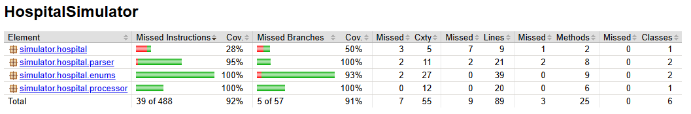

# Hospital Simulator

## Overview
The Hospital Simulator is a Java-based application that simulates the effects of various drugs on patients with different health conditions. 
It processes input representing patient conditions and drugs, applies the drug interactions, and outputs the resulting patient states. 
The simulator is designed to model simplified medical scenarios and demonstrate the impact of drug interactions.

## Technologies Used
- Java 21
- Maven
- JUnit 5
- SLF4J with Logback
- JaCoCo for test coverage

## Build Instructions

### Build the Project
Run the following command to build the project and create a runnable JAR:
```bash
mvn clean package
```
If you don't have Maven installed, you can use the Maven Wrapper:
```bash
./mvnw clean package
```

### Run the Application
The runnable JAR is created in the target directory. Use the following command to execute it:
```bash
java -jar target/HospitalSimulator-1.0-SNAPSHOT-jar-with-dependencies.jar [<patients>] [<drugs>]
```
To activate logs, use:
```bash
java -Dlogback.configurationFile=src/main/resources/logback.xml -jar target/HospitalSimulator-1.0-SNAPSHOT-jar-with-dependencies.jar [<patients>] [<drugs>]
```

## Examples
### 1. Diabetic patients die without Insulin
```bash
java -jar target/HospitalSimulator-1.0-SNAPSHOT-jar-with-dependencies.jar D,D
F:0,H:0,D:0,T:0,X:2
```

### 2. Paracetamol cures Fever
```bash
java -jar target/HospitalSimulator-1.0-SNAPSHOT-jar-with-dependencies.jar F P
F:0,H:1,D:0,T:0,X:0
```

### 3. Insulin + Antibiotic interaction
```bash
java -jar target/HospitalSimulator-1.0-SNAPSHOT-jar-with-dependencies.jar T,F,D An,I
F:2,H:0,D:1,T:0,X:0
```

# Assumptions
- Each patient receives the entire set of drugs sequentially as provided in the input.
- Invalid input codes (for conditions or drugs) will throw an exception.
- No drugs in the input means no drug effects are applied (see example 1).

# Tools

### Jacoco Test Coverage Report
This project uses JaCoCo to generate test coverage reports.
Run the following command to generate the test coverage report:
```bash
mvn verify
```
After the build completes, open the following file in a web browser. The report is located at:
`/target/site/jacoco/index.html`

### Code Coverage

The project has a high test coverage as shown below:

